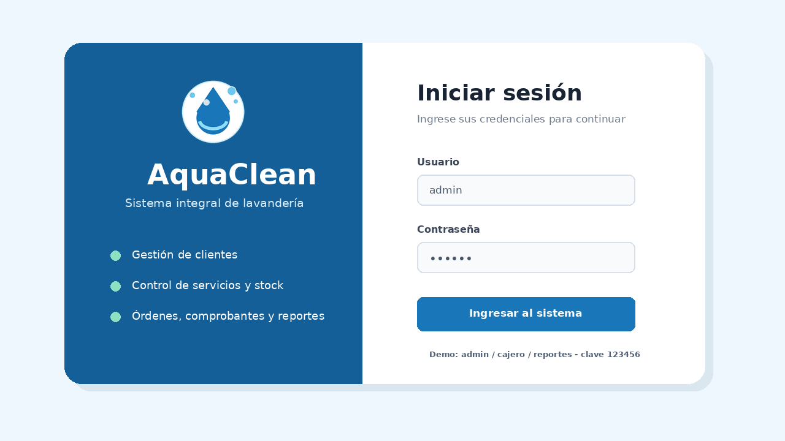
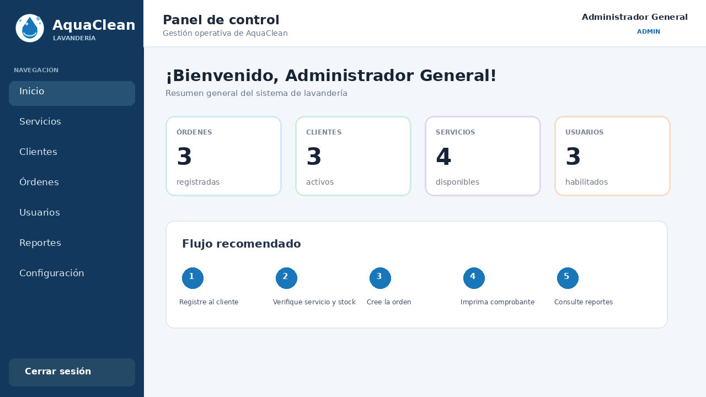

# AquaClean - Sistema de Lavandería

Proyecto final de Programación Orientada a Objetos con **Java 21, JavaFX, FXML, CSS, Maven y MySQL**.

## Funciones

- Login con roles `ADMIN`, `CAJERO` y `REPORTES`.
- Un único `dashboard.fxml` que cambia según el rol.
- CRUD de servicios, clientes, usuarios y órdenes.
- Control automático de stock al crear, editar o eliminar órdenes.
- Impresión de comprobantes.
- Estadísticas con gráfico circular.
- Exportación de reportes a CSV.
- Configuración de datos de la empresa.
- Validaciones de campos vacíos, positivos, duplicados y contraseña mínima.

## Pilares de POO

- **Encapsulamiento:** atributos privados y métodos get/set.
- **Herencia:** `Usuario` y `Cliente` heredan de `Persona`.
- **Polimorfismo:** las clases hijas sobrescriben `mostrarTipo()`.
- **Abstracción:** `Persona` es abstracta e `ICRUD<T>` define el contrato DAO.

## Configuración MySQL

Ejecute `Poo_lavanderia.sql` en MySQL Workbench.

Valores predeterminados en `Conexion.java`:

```text
Puerto: 3307
Base: Poo_lavanderia
Usuario: root
Contraseña: 1234
```

Si su instalación es distinta, cambie esos valores o use:

```text
DB_URL
DB_USER
DB_PASSWORD
```

## Credenciales de prueba

| Rol | Usuario | Contraseña |
|---|---|---|
| ADMIN | `admin` | `123456` |
| CAJERO | `cajero` | `123456` |
| REPORTES | `reportes` | `123456` |

## Ejecución

1. Abra esta carpeta en IntelliJ.
2. Espere a que Maven descargue dependencias.
3. Ejecute `com.example.lavanderia.app.Main`.

También:

```bash
mvn clean javafx:run
```

Para comprobar la conexión, ejecute `PruebaConexion`.

## Estructura

```text
src/main/java/com/example/lavanderia
├── app
├── controller
├── dao
├── db
├── model
└── util

src/main/resources/com/example/lavanderia
├── css
└── view
```

## Roles

- **ADMIN:** acceso total.
- **CAJERO:** clientes, servicios, órdenes, stock y comprobantes.
- **REPORTES:** consulta, gráfico y exportación CSV sin modificación.

> Las contraseñas están en texto plano por alcance académico. En producción deben almacenarse con hash.

## Documentacion incluida

- `documentacion/Manual_Usuario_AquaClean.pdf`: manual de 2 paginas.
- `CHECKLIST_ENTREGA.md`: lista de verificacion antes de presentar.
- `GUIA_DEFENSA.md`: explicacion de POO, roles, DAO y transacciones.
- `guion_video_demo.txt`: guion para el video de maximo 3 minutos.
- `INSTRUCCIONES_EXE.md`: creacion del ejecutable con Launch4j.
- `INSTRUCCIONES_IMPORTAR.md`: pasos para copiar el proyecto al repositorio del grupo.

## Capturas de referencia




