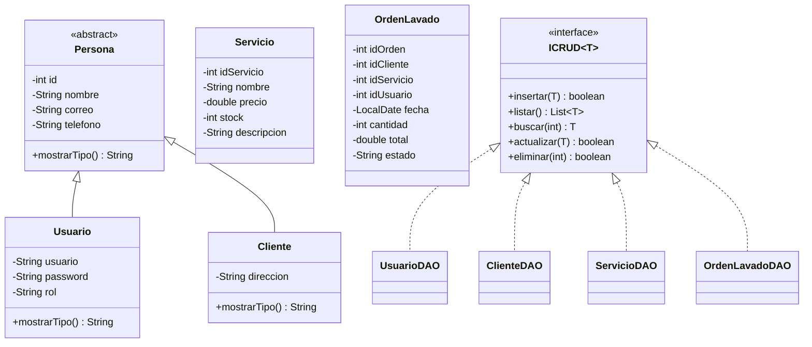

# Arquitectura de AquaClean


```mermaid
classDiagram
    class Persona {
        <<abstract>>
        -int id
        -String nombre
        -String correo
        -String telefono
        +mostrarTipo() String
    }
    class Usuario {
        -String usuario
        -String password
        -String rol
        +mostrarTipo() String
    }
    class Cliente {
        -String direccion
        +mostrarTipo() String
    }
    Persona <|-- Usuario
    Persona <|-- Cliente

    class Servicio {
        -int idServicio
        -String nombre
        -double precio
        -int stock
        -String descripcion
    }
    class OrdenLavado {
        -int idOrden
        -int idCliente
        -int idServicio
        -int idUsuario
        -LocalDate fecha
        -int cantidad
        -double total
        -String estado
    }

    class ICRUD~T~ {
        <<interface>>
        +insertar(T) boolean
        +listar() List~T~
        +buscar(int) T
        +actualizar(T) boolean
        +eliminar(int) boolean
    }

    ICRUD <|.. UsuarioDAO
    ICRUD <|.. ClienteDAO
    ICRUD <|.. ServicioDAO
    ICRUD <|.. OrdenLavadoDAO
```

## Flujo por capas

```text
FXML + CSS
    ↓
Controller
    ↓
DAO / ICRUD
    ↓
Conexion Singleton
    ↓
MySQL - Poo_lavanderia
```
